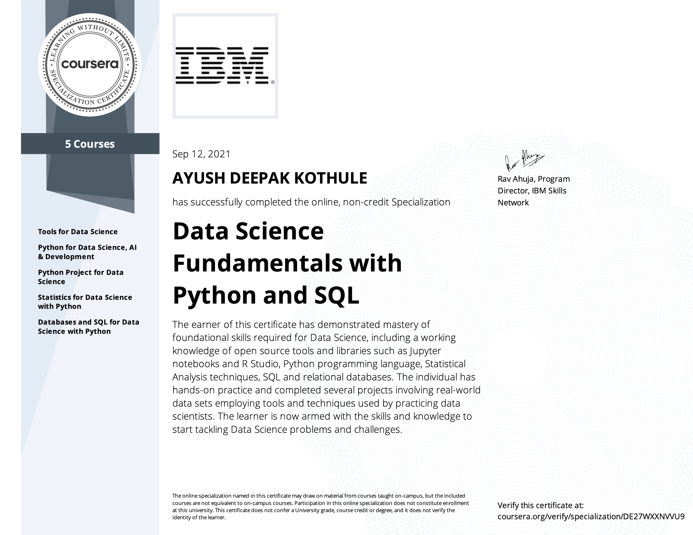

# Data Science Fundamentals with Python & SQL

Successfully completed the [data science specialization course](https://www.coursera.org/specializations/data-science-fundamentals-python-sql) offered by IBM at Coursera. 

Verify this certificate at: https://coursera.org/verify/specialization/DE27WXXNVVU9

This specialization includes following five courses:
1. [Tools for Data Science](https://coursera.org/verify/5LWFQX9RLUUR)
2. [Python for Data Science, AI & Development](https://coursera.org/verify/RWBJWY4XF7YC)
3. [Python Project for Data Science](https://coursera.org/verify/B4NVMGHL2ALJ)
   * Completed a data science project for analyzing historical stock prices and revenue trends of Tesla and GameStop. Self-taught web scraping techniques using Python and Jupyter Notebook for data mining. Plotted visual graphs, analyzed financial data, and recommended growth-oriented stock for investment. 
4. [Statistics for Data Science with Python](https://coursera.org/verify/4SVB2ZWY3H8L)
   * Prepared housing statistics report for housing agency in Boston, MA. Used IBM Watson Studio and the data from U.S. Census Service. Self-taught Scipy.stats and Pandas framework for data analysis. Created histograms and scatterplots to test the hypothesis. Created report with insights on the median value of houses bound by the Charles River.
5. [Databases and SQL for Data Science with Python \(Completed with honors\)](https://coursera.org/verify/A8L4GMQFYHFU)